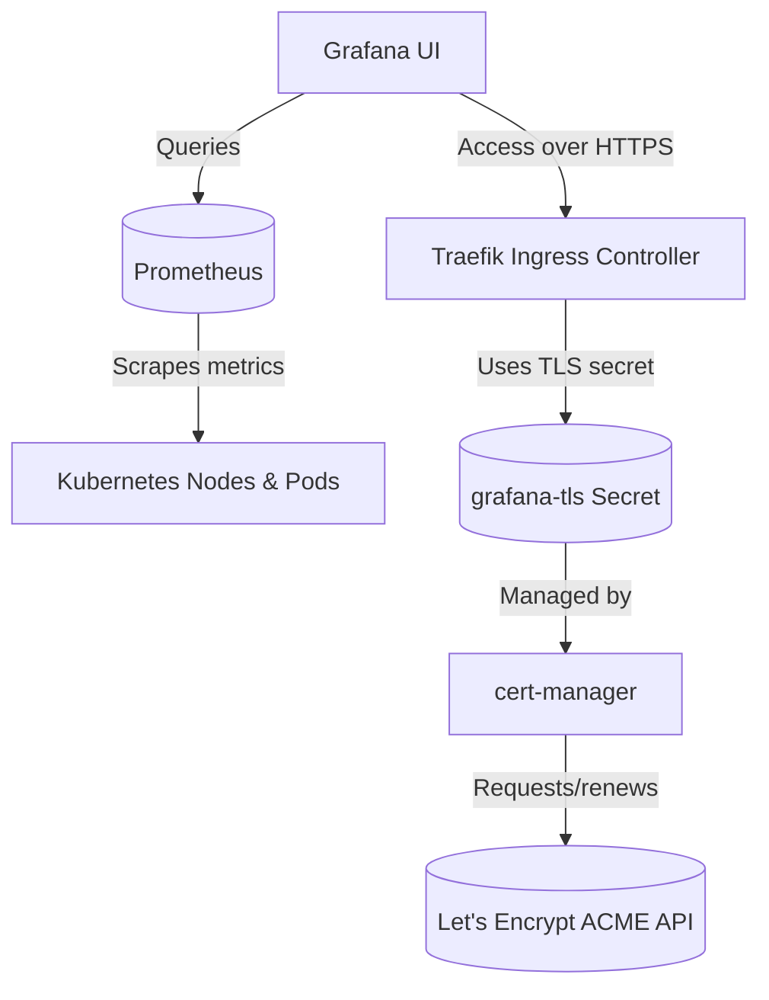

# Kubernetes Monitoring Stack — Prometheus & Grafana with Auto TLS
A complete monitoring stack for Kubernetes clusters using Prometheus and Grafana, with automatic SSL/TLS provisioning through cert-manager and Let’s Encrypt.

[](./LICENSE)
[]()
[]()
[]()
[]()


## 🚀 Features
✅ Prometheus for metrics scraping and storage<br>
✅ Grafana for rich dashboards and visualization<br>
✅ Traefik Ingress Controller (or NGINX) for routing<br>
✅ Automatic HTTPS with cert-manager + Let’s Encrypt<br>
✅ Namespace isolation (`monitoring`)<br>
✅ One-command deployment via `deploy.sh`

## ⚙️ Requirements

| Component | Description |
|------------|-------------|
| 🧠 **Kubernetes Cluster** | Version 1.24+ (k8s, k3s, minikube, EKS, etc.) |
| ☸️ **kubectl** | Installed and configured with cluster access |
| 📦 **Helm** | For installing `cert-manager` |
| 🧾 **yq** and **envsubst** | Required for reading `custom-values.yaml` |
| 🌐 **Valid DNS** | Your domain must point to the Ingress Controller IP |
| 🔐 **Ingress Controller** | e.g. Traefik or NGINX (recommended: Traefik) |


## 📁 Directory Structure
monitoring/
├── custom-values.yaml
├── deploy.sh
├── load-env.sh
└── manifests/
    ├── namespace/
    │   └── namespace.yaml
    ├── prometheus/
    │   ├── configmap.yaml
    │   ├── deployment.yaml
    │   └── service.yaml
    ├── grafana/
    │   ├── deployment.yaml
    │   └── service.yaml
    ├── pvc/
    │   ├── prometheus-pvc.yaml
    │   └── grafana-pvc.yaml
    ├── rbac/
    │   └── prometheus-rbac.yaml
    ├── ingress/
    │   └── ingress.yaml
    └── tls/
        ├── tls-staging.yaml
        ├── tls-prod.yaml
        └── certificate.yaml

## 🔐 Installing cert-manager (Required)
Before deploying the monitoring stack, you must install cert-manager with its CRDs,
so that SSL certificates can be automatically issued and renewed by Let’s Encrypt.
```
helm repo add jetstack https://charts.jetstack.io
helm repo update
helm upgrade --install cert-manager jetstack/cert-manager \
  --namespace cert-manager --create-namespace \
  --set crds.enabled=true
```
Verify installation:
```
kubectl -n cert-manager get pods
```

## ⚙️ Configuration — `custom-values.yaml`
```
namespace:
  name: monitoring

site:
  domain: "monitor.your-domain.com"

ingress:
  className: "traefik"  # or "nginx" if using ingress-nginx

certManager:
  clusterIssuer: "letsencrypt-prod"  # use "letsencrypt-staging" for testing
  email: "admin@your-domain.com"

storage:
  className: ""          # leave empty to use default StorageClass
  prometheus:
    size: "20Gi"
  grafana:
    size: "5Gi"

grafana:
  adminUser: "admin"
  adminPassword: "changeme"
```

## 🧩 Deployment
To deploy the full monitoring stack:
```
chmod +x load-env.sh deploy.sh
./deploy.sh
```
The script will:
1. Load environment variables from `custom-values.yaml`
2. Create the namespace and RBAC for Prometheus
3. Deploy PVCs, Deployments, and Services for Prometheus & Grafana
4. Create TLS ClusterIssuer (Let’s Encrypt staging or production)
5. Apply Certificate and Ingress with automatic HTTPS
6. Wait for all deployments to become ready

## 🌍 Accessing Grafana
Once deployment completes successfully:

- Grafana URL:
    👉 https://monitor.your-domain.com

- Default credentials:
```
Username: admin
Password: changeme
```
(Credentials are configurable in `custom-values.yaml`.)

## 🔄 Switching Between Staging & Production
To switch from Let’s Encrypt <b>staging</b> (untrusted) to <b>production</b> (valid certificate):
```
yq -i '.certManager.clusterIssuer = "letsencrypt-prod"' custom-values.yaml
./deploy.sh
```

## 🧠 How SSL/TLS Works Here
1. <b>cert-manager</b> watches for Certificate resources in your cluster.
2. When a new certificate is requested, it automatically creates an <b>ACME HTTP-01 Challenge</b>.
3. The challenge is routed through your <b>Ingress (Traefik/NGINX)</b>.
4. Let’s Encrypt validates the challenge over port 80.
5. cert-manager retrieves the certificate and stores it in a <b>Kubernetes Secret</b> (`grafana-tls`).
6. Your Ingress then uses that Secret to serve HTTPS.
This ensures <b>automatic certificate issuance and renewal</b> — no manual certbot or key management needed.

## 🔁 Enabling HTTPS Redirect (Traefik)
To automatically redirect HTTP → HTTPS, run:
```
kubectl -n monitoring annotate ingress grafana-ingress \
  traefik.ingress.kubernetes.io/router.entrypoints="web,websecure" \
  traefik.ingress.kubernetes.io/router.tls="true" \
  traefik.ingress.kubernetes.io/redirectscheme.scheme="https" \
  --overwrite
```
Or, include these annotations directly in your `manifests/ingress/ingress.yaml` file.

## 🧹 Cleanup
To remove all monitoring resources:
```
kubectl delete namespace monitoring
```
To uninstall cert-manager (optional):
```
helm uninstall cert-manager -n cert-manager
kubectl delete namespace cert-manager
```

## 🧩 Architecture Overview

### Flow Description:
1. Prometheus scrapes metrics from Kubernetes nodes, pods, and services.
2. Grafana queries Prometheus to visualize cluster health and performance.
3. External access to Grafana is routed through the Traefik Ingress Controller.
4. cert-manager automatically handles TLS certificates via Let’s Encrypt and stores them as Kubernetes Secrets (`grafana-tls`).
5. The Ingress uses that secret to serve HTTPS securely.

## 🧾 License
This project is licensed under the **MIT License** — see the [LICENSE](./LICENSE) file for details.  
© 2025 Didin Media Group. Maintained by [@achmadsholehudin](https://github.com/achmadsholehudin)

## 🤝 Contributing
Contributions, issues, and feature requests are welcome!  
Feel free to open a pull request or report a bug via [GitHub Issues](../../issues).
