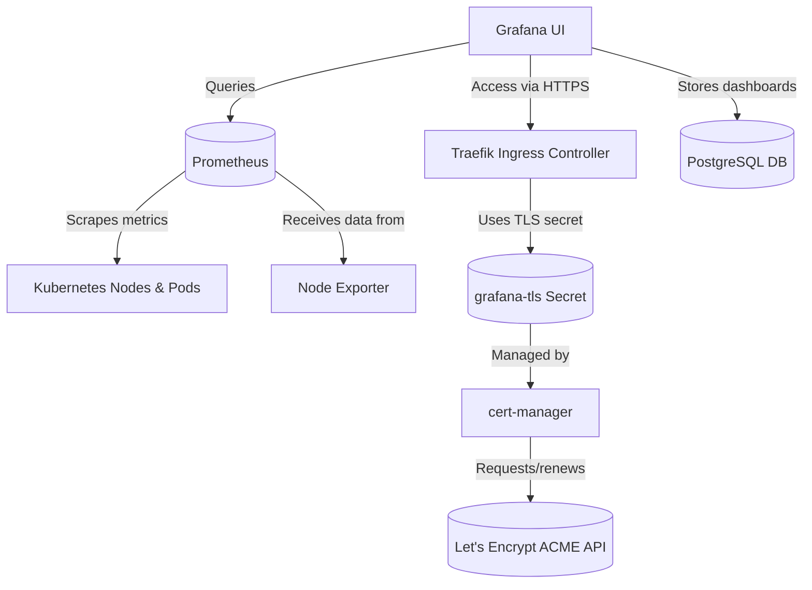

# Kubernetes Monitoring Stack — Prometheus & Grafana with Auto TLS
A complete production-ready monitoring stack for Kubernetes clusters using **Prometheus**, **Grafana**, and **PostgreSQL**, with automatic SSL/TLS provisioning through **cert-manager** and **Let’s Encrypt**.

[](./LICENSE)
[]()
[]()
[]()
[]()
[]()


## 🚀 Features
✅ Prometheus for metrics scraping and storage<br>
✅ Grafana for rich dashboards and visualization<br>
✅ Traefik Ingress Controller (or NGINX) for routing<br>
✅ Automatic HTTPS with cert-manager + Let’s Encrypt<br>
✅ PostgreSQL as Grafana data source (persistent database) <br> 
✅ Horizontal Pod Autoscaler (HPA) for Grafana and Prometheus  <br>
✅ Namespace isolation (`monitoring`)<br>
✅ One-command deployment via `deploy.sh`

## ⚙️ Requirements

| Component | Description |
|------------|-------------|
| 🧠 **Kubernetes Cluster** | Version 1.24+ (k8s, k3s, minikube, EKS, etc.) |
| ☸️ **kubectl** | Installed and configured with cluster access |
| 📦 **Helm** | For installing `cert-manager` |
| 🧾 **yq** and **envsubst** | Required for reading `custom-values.yaml` |
| 🌐 **Valid DNS** | Your domain must point to the Ingress Controller IP |
| 🔐 **Ingress Controller** | e.g. Traefik or NGINX (recommended: Traefik) |


## 📁 Directory Structure

```bash
monitoring/
├── custom-values.yaml
├── custom-values.yaml.example
├── deploy.sh
├── LICENSE
├── load-env.sh
├── manifests/
│   ├── namespace/
│   │   └── namespace.yaml
│   ├── prometheus/
│   │   ├── configmap.yaml
│   │   ├── deployment.yaml
│   │   ├── service.yaml
│   │   ├── service-headless.yaml
│   │   └── statefulset.yaml
│   ├── grafana/
│   │   ├── deployment.yaml
│   │   └── service.yaml
│   ├── postgres/
│   │   ├── statefulset.yaml
│   │   └── service.yaml
│   ├── pvc/
│   │   ├── prometheus-pvc.yaml
│   │   └── grafana-pvc.yaml
│   ├── hpa/
│   │   ├── grafana-hpa.yaml
│   │   └── prometheus-hpa.yaml
│   ├── rbac/
│   │   └── prometheus-rbac.yaml
│   ├── ingress/
│   │   └── ingress.yaml
│   └── tls/
│       ├── certificate.yaml
│       ├── tls-staging.yaml
│       └── tls-prod.yaml
└── README.md

```
🧱 Note:
    - PostgreSQL uses a <b>StatefulSet</b> with volumeClaimTemplates for automatic persistent storage (no separate PVC manifest).
    - Prometheus can run in <b>Deployment</b> or <b>StatefulSet</b> mode — both supported by `deploy.sh`.

## 🔐 Installing cert-manager (Required)
Before deploying the monitoring stack, you must install cert-manager with its CRDs,
so that SSL certificates can be automatically issued and renewed by Let’s Encrypt.
```
helm repo add jetstack https://charts.jetstack.io
helm repo update
helm upgrade --install cert-manager jetstack/cert-manager \
  --namespace cert-manager --create-namespace \
  --set crds.enabled=true
```
Verify installation:
```
kubectl -n cert-manager get pods
```

## 📊 Install Node Exporter (Recommended)
Node Exporter collects system-level metrics for Prometheus (CPU, memory, disk usage).
```
helm repo add prometheus-community https://prometheus-community.github.io/helm-charts
helm repo update
helm upgrade --install node-exporter prometheus-community/prometheus-node-exporter \
  --namespace monitoring --create-namespace
```

## ⚙️ Configuration — `custom-values.yaml`
Create your own `custom-values.yaml` file in the project root directory.<br>
You can start by copying the example template:
```
cp custom-values.yaml.example custom-values.yaml
echo "custom-values.yaml" >> .gitignore
```
⚠️ Note: `custom-values.yaml` is ignored from Git tracking to protect sensitive data (like admin passwords).
Then, edit the file according to your environment:
```
# ------------------------------
# Namespace configuration
# ------------------------------
namespace:
  name: monitoring        # Kubernetes namespace where all components will be deployed

# ------------------------------
# Domain & ingress settings
# ------------------------------
site:
  domain: "monitor.example.com"  # Public domain for accessing Grafana via HTTPS

ingress:
  className: "traefik"           # Ingress class (e.g., "traefik" or "nginx")

# ------------------------------
# cert-manager configuration
# ------------------------------
certManager:
  clusterIssuer: "letsencrypt-staging"   # Use "letsencrypt-prod" for production
  email: "admin@example.com"             # Email used for Let's Encrypt notifications

# ------------------------------
# PostgreSQL configuration (for Grafana DB)
# ------------------------------
postgres:
  enabled: true               # Enable or disable PostgreSQL deployment
  service:
    name: "grafana-postgresql"  # Service name used by Grafana to connect to PostgreSQL
    port: 5432                  # Default PostgreSQL port
  auth:
    dbName: "grafana"           # Database name used by Grafana
    user: "grafana"             # Database username
    password: "password"        # ⚠️ Change this before deploying (will be stored as a Secret)

# ------------------------------
# Persistent storage configuration
# ------------------------------
storage:
  className: ""           # Leave empty to use cluster’s default StorageClass
  prometheus:
    size: "20Gi"          # Persistent volume size for Prometheus data
  grafana:
    size: "5Gi"           # Persistent volume size for Grafana data
  postgres:
    size: "5Gi"           # Persistent volume size for PostgreSQL data

# ------------------------------
# Grafana administrator account
# ------------------------------
grafana:
  adminUser: "admin"       # Default Grafana admin username
  adminPassword: "changeme" # ⚠️ Change this password before deploying

# ------------------------------
# Container image versions
# ------------------------------
images:
  prometheus: "prom/prometheus:v2.55.0"   # Prometheus container image
  grafana: "grafana/grafana:11.2.0"       # Grafana container image
  postgres: "postgres:16-alpine"          # PostgreSQL container image

# ------------------------------
# Replica counts
# ------------------------------
replicas:
  prometheus: 1            # Prometheus replicas (recommended 1–3 for HA)
  grafana: 1               # Grafana replicas
  postgres: 1              # PostgreSQL replicas (StatefulSet manages persistence)

# ------------------------------
# Horizontal Pod Autoscaling
# ------------------------------
autoscaling:
  enabled: true             # Enable HPA for Prometheus and Grafana

  prometheus:
    minReplicas: 1          # Minimum number of replicas
    maxReplicas: 3          # Maximum number of replicas
    targetCPUUtilizationPercentage: 70    # Target CPU utilization threshold
    targetMemoryUtilizationPercentage: 80 # Target Memory utilization threshold

  grafana:
    minReplicas: 1
    maxReplicas: 3
    targetCPUUtilizationPercentage: 70
    targetMemoryUtilizationPercentage: 80
```

## 🧩 Deployment
To deploy the full monitoring stack:
```
chmod +x load-env.sh deploy.sh
./deploy.sh
```
The script will:
1. Load all environment variables from `custom-values.yaml`
2. Create the namespace and RBAC for Prometheus
3. Deploy Prometheus (as StatefulSet) and Grafana (as Deployment)
4. Deploy PostgreSQL as Grafana’s data store
5. Apply HPA for Grafana and Prometheus (if enabled)
6. Apply TLS ClusterIssuer, Certificate, and Ingress
7. Wait for all components to become ready

## 🌍 Accessing Grafana
Once deployment completes successfully:

- Grafana URL:
    👉 https://monitor.your-domain.com

- Default credentials:
```
Username: admin
Password: changeme
```
(Credentials are configurable in `custom-values.yaml`.)
Grafana connects automatically to:
    - Prometheus as its data source
    - PostgreSQL as its backend database (for dashboards, users, etc.)

## 📈 Horizontal Pod Autoscaler (HPA)
HPA automatically scales replicas based on resource utilization.
Example command to monitor scaling:
```
kubectl -n monitoring get hpa
kubectl -n monitoring describe hpa grafana
kubectl -n monitoring top pods
```
Grafana and Prometheus both support HPA (Prometheus only if using Deployment mode).
You can adjust thresholds and replica ranges in `custom-values.yaml`.

## 🔄 Switching Between Staging & Production
To switch from Let’s Encrypt <b>staging</b> (untrusted) to <b>production</b> (valid certificate):
```
yq -i '.certManager.clusterIssuer = "letsencrypt-prod"' custom-values.yaml
./deploy.sh
```

## 🧠 How SSL/TLS Works Here
1. <b>cert-manager</b> watches for Certificate resources in your cluster.
2. When a new certificate is requested, it automatically creates an <b>ACME HTTP-01 Challenge</b>.
3. The challenge is routed through your <b>Ingress (Traefik/NGINX)</b>.
4. Let’s Encrypt validates the challenge over port 80.
5. cert-manager retrieves the certificate and stores it in a <b>Kubernetes Secret</b> (`grafana-tls`).
6. Your Ingress then uses that Secret to serve HTTPS.
This ensures <b>automatic certificate issuance and renewal</b> — no manual certbot or key management needed.

## 🔁 Enabling HTTPS Redirect (Traefik)
To automatically redirect HTTP → HTTPS, run:
```
kubectl -n monitoring annotate ingress grafana-ingress \
  traefik.ingress.kubernetes.io/router.entrypoints="web,websecure" \
  traefik.ingress.kubernetes.io/router.tls="true" \
  traefik.ingress.kubernetes.io/redirectscheme.scheme="https" \
  --overwrite
```
Or, include these annotations directly in your `manifests/ingress/ingress.yaml` file.

## 💾 Resource Management
Each component defines `resource` requests and `limits`:
    - Requests: guaranteed minimum resources for scheduling.
    - Limits: maximum resources before throttling (CPU) or OOMKill (Memory).
✅ Example (safe default):
```
resources:
  requests:
    cpu: "100m"
    memory: "256Mi"
  limits:
    cpu: "500m"
    memory: "1Gi"
```
Grafana and Prometheus can dynamically scale via HPA.

## 🧹 Cleanup
To remove all monitoring resources:
```
kubectl delete namespace monitoring
```
To uninstall cert-manager (optional):
```
helm uninstall cert-manager -n cert-manager
kubectl delete namespace cert-manager
```

## 🧩 Architecture Overview

### Flow Description:
1. Prometheus scrapes metrics from Kubernetes nodes, pods, and services.
2. Grafana queries Prometheus to visualize cluster health and performance.
3. External access to Grafana is routed through the Traefik Ingress Controller.
4. cert-manager automatically handles TLS certificates via Let’s Encrypt and stores them as Kubernetes Secrets (`grafana-tls`).
5. The Ingress uses that secret to serve HTTPS securely.
6. HPA dynamically adjusts workloads based on CPU/memory usage.

## 🧾 License
This project is licensed under the **MIT License** — see the [LICENSE](./LICENSE) file for details.  
© 2025 Achmad Sholehudin. Maintained by [@achmadsholehudin](https://github.com/achmadsholehudin)

## 🤝 Contributing
Contributions, issues, and feature requests are welcome!  
Feel free to open a pull request or report a bug via [GitHub Issues](../../issues).
